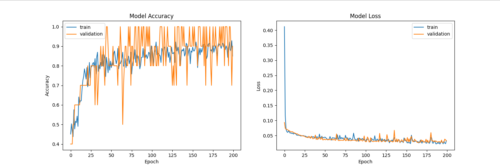

Classifier "Field" vs "Road"
----
----

This repository contains an image classification model to distinguish between images of fields and images of roads.
* The training dataset consists of 110 road images and 43 field images, while the validation dataset is composed of 10 images.

Installation :
---
---
`conda create -n frc python=3.9`

`conda activate frc` (frc = field road classifier)

`pip install -r requirements.txt`

Download checkpoint from this link : https://drive.google.com/file/d/1uPgz1a8EELs1mgoJKwtZLZ5w795YYB9u/view?usp=share_link

`cd checkpoints & tar -xvzf your_tar_gz_file_.tar -C .`

## Dataset

The dataset is divided into two folders: "train" and "val". The "train" folder contains the images used to train the model, while the "val" folder contains images used to validate the model.

## Model & Results

The model was trained on the "train" data and validated on the "val" data. 
There are two models that have been trained, the v1 and v2. The v1 achieves 100% accuracy on the test set, 
but because the test dataset is too small, this does not reflect reality. 
The v2 achieves 90% (1 missed object out of 10) but generalizes much better (keep eays on checkpoints directory).

An unrepresentative validation dataset means that the validation dataset does not provide sufficient information to evaluate the ability of the model to generalize.

This may occur if the validation dataset has too few examples as compared to the training dataset.

This case can be identified by a learning curve for training loss/accuracy that looks like a good fit (or other fits) 
and a learning curve for validation loss that shows noisy movements around the training loss.

## Training

`python train.py --data_path data/dataset --epochs 200 --model_name test`

## Inference

`python inference.py --data_path data/dataset/val --model_path checkpoints/v2/best_v2_model.h5`

## Predict

`python predict.py --image_path PATH --model_path checkpoints/v2/best_v2_model.h5`

